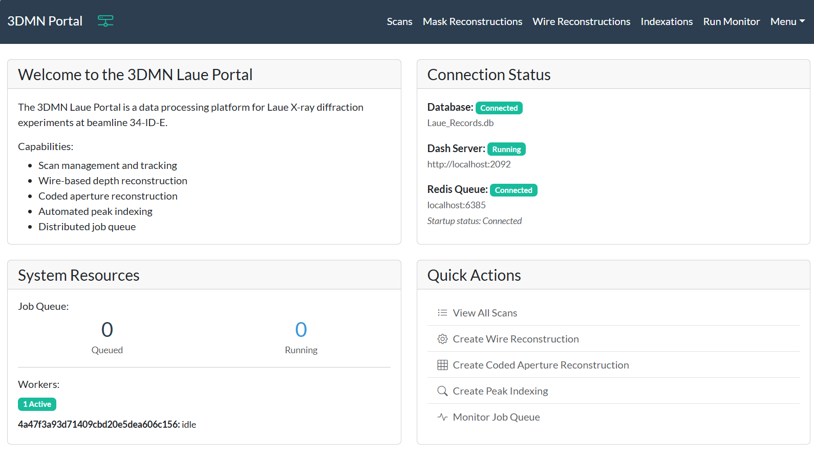

# Laue Portal

A web-based platform for managing Laue X-ray diffraction data processing workflows at APS beamline 34-ID-E. Currently under construction!



## Overview

Laue Portal provides a Dash-based interface for processing and analyzing depth resolved X-ray diffraction data. It manages the workflow from scan metadata collection through peak indexing and 3D reconstruction.

## Installation

### Prerequisites
- Python 3.11+
- Redis server
- SQLite

### Setup

1. Clone the repository:
```bash
git clone https://github.com/Linked-Liszt/laue-portal.git
cd laue-portal
```

2. Install dependencies:
```bash
pip install -r requirements.txt
```

3. Configure the application by editing `config.py`:
   - `db_file`: Database path (default: `Laue_Records.db`)
   - `REDIS_CONFIG`: Redis connection settings
   - `DASH_CONFIG`: Web server host/port (default: `localhost:2092`)
   - `DEFAULT_VARIABLES`: Processing parameters and workspace paths

## Usage

### Start the Web Application Without Processing

```bash
python lau_dash.py
```

### Production Deployment with Supervisor

```bash
cd supervisor
./setup_supervisor.sh <conda_env_name_or_path>
./start_supervisor.sh
```

See `supervisor/README.md` for detailed management commands.

## Project Structure

```
laue-portal/
├── lau_dash.py              # Main Dash application
├── config.py                # Configuration settings
├── laue_portal/
│   ├── components/          # UI components and forms
│   ├── database/            # SQLAlchemy models and utilities
│   ├── pages/               # Page layouts and callbacks
│   ├── processing/          # RQ workers and Redis utilities
│   └── recon/               # Reconstruction analysis tools
├── polaris_workflow/        # HPC workflow integration (Gladier/funcX)
├── supervisor/              # Production deployment scripts
└── tests/                   # Test suite
```


## Development

### Running Tests

```bash
pytest tests/
```
