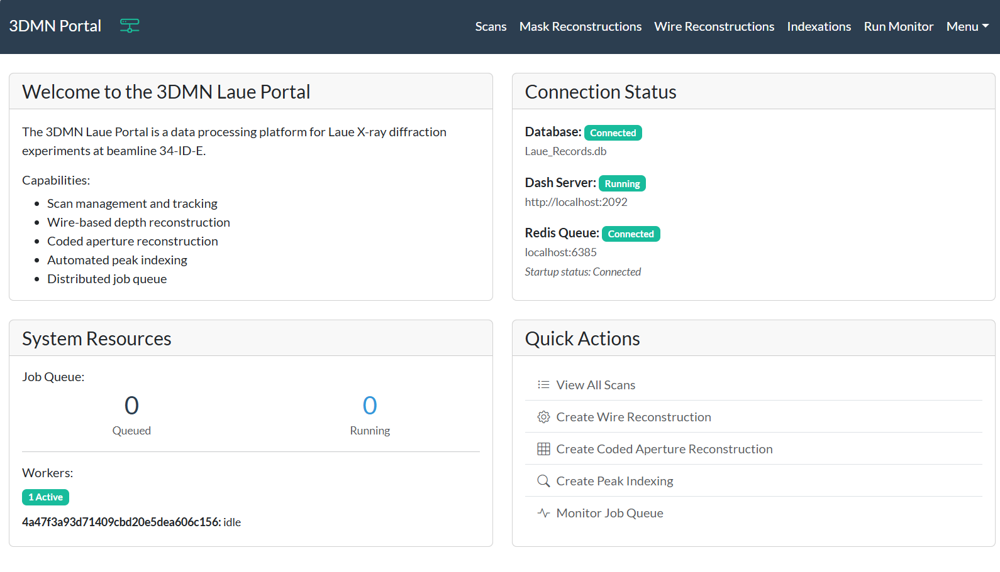

# Laue Portal

A web-based platform for managing Laue X-ray diffraction data processing workflows at APS beamline 34-ID-E. Currently under construction!



## Overview

Laue Portal provides a Dash-based interface for processing and analyzing depth resolved X-ray diffraction data. It manages the workflow from scan metadata collection through peak indexing and 3D reconstruction.

### Current processing limits

Indexing writes one HDF5 results file and an aggregate XML file per run.
The indexing Cosmic Filter control is hidden and disabled: no single-frame
filtering algorithm has been defined for it. Historical records retain the
saved setting, but new runs and reruns do not apply it.

Wire reconstruction remains functional with the existing output format: one
HDF5 image per depth and one summary file per point. Cancellation takes effect
between points. A unified reconstruction file and finer-grained cancellation
remain open library work. This refactor is not required to use indexing or
visualization, but is required before production reconstruction meets the
requirement for a constant number of files per run. The cutover preflight checks
operational configuration and database state; it does not establish that requirement.

## Installation

### Prerequisites
- Python 3.11+
- Redis server
- SQLite

### Setup

1. Clone the repository:
```bash
git clone https://github.com/Linked-Liszt/laue-portal.git
cd laue-portal
```

2. Install dependencies:
```bash
pip install -r requirements.txt
```

3. Configure the application by editing `config.py`:
   - `db_file`: Database path (default: `Laue_Records.db`)
   - `REDIS_CONFIG`: Redis connection settings
   - `DASH_CONFIG`: Web server host/port (default: `localhost:2092`)
   - `DEFAULT_VARIABLES`: Processing parameters and workspace paths

## Usage

### Start the Web Application Without Processing

```bash
python lau_dash.py
```

### Production Deployment with Supervisor

```bash
cd supervisor
./setup_supervisor.sh <conda_env_name_or_path>
./start_supervisor.sh
```

See `supervisor/README.md` for detailed management commands.

## Project Structure

```
laue-portal/
├── lau_dash.py              # Main Dash application
├── config.py                # Configuration settings
├── laue_portal/
│   ├── components/          # UI components and forms
│   ├── database/            # SQLAlchemy models and utilities
│   ├── pages/               # Page layouts and callbacks
│   ├── processing/          # RQ workers and Redis utilities
│   └── recon/               # Reconstruction analysis tools
├── polaris_workflow/        # HPC workflow integration (Gladier/funcX)
├── supervisor/              # Production deployment scripts
└── tests/                   # Test suite
```


## Development

### Running Tests

```bash
pytest tests/
```

### Spot limits and sizes

In the indexing form, **Max detected spots** limits Peak Search; leave it blank
for no detection cap. **Max spots to index** limits the detected spots used by
the orientation indexer; leaving it blank uses 200. These controls retain their
saved field names (`max_number` and `max_peaks`, respectively). Min Spot Size is
in pixels and must be a positive integer; `3` and `3.0` are both accepted.
Historical records retain their original values for inspection.

For databases created before blank detection limits were supported, run
`scripts/migrate_workflow_database.py` to a new database before switching the
portal configuration. The upgrade preserves saved values and makes the detection
limit nullable. The cutover check reports an old required limit as a schema issue.
